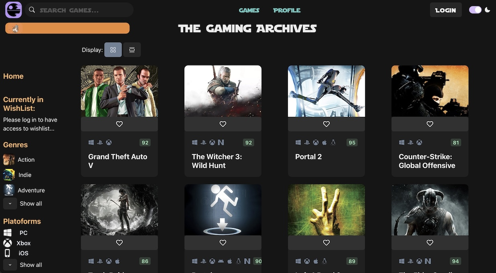

# The Gaming Archives

Welcome to **The Gaming Archives**! Think of it as IMDB, but dedicated to the world of video games. Explore detailed game profiles, or sign up to personalize your experience and curate a wishlist of your dream games.

 <!-- Replace with actual path to your screenshot -->

## Table of Contents

- [Getting Started](#getting-started)
- [Usage](#usage)
- [Features](#features)

## Getting Started

To get The Gaming Archives running locally:

1. Clone this repository.
2. Navigate to the project directory.
3. Run the following commands:
   ```shell
   npm install
   npm run dev
   ```
   // Your application should now be running at http://localhost:3000/ (or your specified port).
4. Or simply go to https://boisterous-meringue-c0d83d.netlify.app/ to check out the live website.

## Usage

Browsing: Dive into the vast world of games. Each game has a dedicated profile with detailed information.

Account Creation & Wishlist: To enjoy a personalized experience, consider creating an account. Once logged in, you'll have the power to curate your very own wishlist of games.

## Features

Wishlist: Exclusively available to logged-in users, the wishlist feature allows you to keep track of the games you're eager to play.
